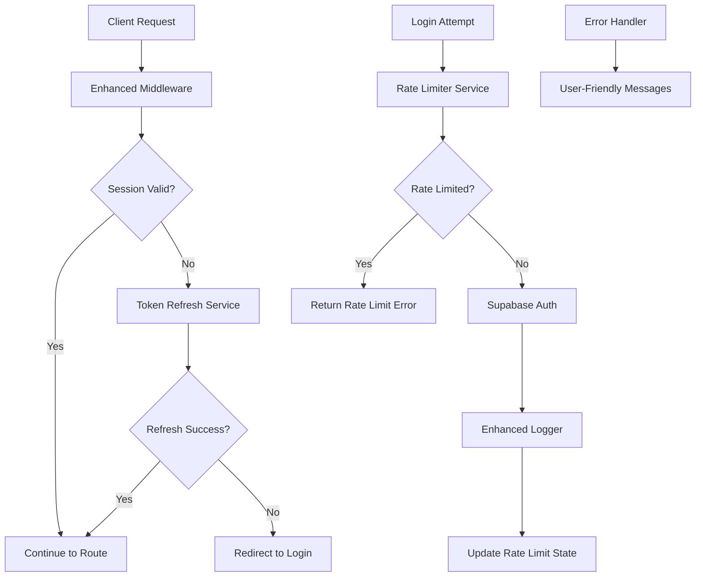

# Enhanced Authentication & Rate Limiting System Design

## Overview

This design enhances the existing Supabase-based authentication system by implementing robust session management, intelligent rate limiting, comprehensive error handling, and improved user experience. The solution builds upon the current Next.js middleware and AuthContext while adding new components for rate limiting, token refresh, and enhanced logging.

## Architecture

### Current System Analysis
- **Middleware**: Basic session checking with simple redirects
- **AuthContext**: Direct Supabase auth with basic error handling
- **Rate Limiting**: Simple IP-based counter in log-login-attempt API
- **Error Handling**: Technical errors exposed to users

### Enhanced Architecture Components



## Components and Interfaces

### 1. Enhanced Middleware (`src/middleware.ts`)

**Purpose**: Intelligent session management with automatic token refresh

**Key Features**:
- Automatic token refresh before expiration
- Graceful handling of invalid refresh tokens
- Consistent error responses
- Support for both API and page routes

**Interface**:
```typescript
interface EnhancedMiddlewareConfig {
  protectedRoutes: string[]
  publicRoutes: string[]
  authRoutes: string[]
  refreshThreshold: number // minutes before expiry to refresh
}
```

### 2. Token Refresh Service (`src/services/tokenRefreshService.ts`)

**Purpose**: Handle automatic token refresh logic

**Key Features**:
- Proactive token refresh
- Retry logic with exponential backoff
- Secure token storage
- Event emission for auth state changes

**Interface**:
```typescript
interface TokenRefreshService {
  refreshToken(): Promise<RefreshResult>
  scheduleRefresh(expiresAt: number): void
  clearRefreshTimer(): void
}

interface RefreshResult {
  success: boolean
  error?: AuthError
  newSession?: Session
}
```

### 3. Intelligent Rate Limiter (`src/services/rateLimitService.ts`)

**Purpose**: Progressive rate limiting with user-friendly behavior

**Key Features**:
- Progressive delays (1min, 5min, 15min, 30min)
- IP and email-based tracking
- Automatic reset on successful login
- Bypass for password reset requests

**Interface**:
```typescript
interface RateLimitService {
  checkLimit(identifier: string): Promise<RateLimitResult>
  recordAttempt(identifier: string, success: boolean): Promise<void>
  resetLimit(identifier: string): Promise<void>
}

interface RateLimitResult {
  allowed: boolean
  remainingAttempts: number
  resetTime?: Date
  waitTime?: number
}
```

### 4. Enhanced Auth Context (`src/contexts/AuthContext.tsx`)

**Purpose**: Improved authentication state management with Supabase integration

**Key Features**:
- Automatic token refresh integration
- Enhanced error handling with Supabase auth
- Rate limit awareness
- Role-based access control integration
- Super admin status tracking

**Interface**:
```typescript
interface EnhancedAuthContextType {
  user: User | null // Supabase User object
  userProfile: SupabaseUserProfile | null // Your custom profile data
  isLoading: boolean
  authError: AuthError | null
  rateLimitInfo: RateLimitInfo | null
  isAdmin: boolean // Derived from role === 'admin'
  isSuperAdmin: boolean // From your user_profiles table
  signIn: (email: string, password: string) => Promise<SignInResult>
  signOut: () => Promise<void>
  clearError: () => void
}
```

### 5. Error Handler Service (`src/services/errorHandlerService.ts`)

**Purpose**: Convert technical errors to user-friendly messages

**Key Features**:
- Error categorization
- Localized error messages
- Security-conscious error exposure
- Logging integration

**Interface**:
```typescript
interface ErrorHandlerService {
  handleAuthError(error: AuthError): UserFriendlyError
  handleRateLimitError(rateLimitInfo: RateLimitResult): UserFriendlyError
  logError(error: Error, context: ErrorContext): void
}
```

### 6. Enhanced Logger (`src/services/loggerService.ts`)

**Purpose**: Comprehensive authentication event logging

**Key Features**:
- Structured logging with consistent format
- Security event detection
- Performance metrics
- Privacy-compliant data handling

## Data Models

### Authentication Event Log
```typescript
interface AuthEventLog {
  id: string
  timestamp: Date
  event_type: 'login_attempt' | 'login_success' | 'logout' | 'token_refresh' | 'rate_limit_hit'
  email_attempted?: string
  user_id?: string // References your existing Supabase user IDs
  ip_address: string
  user_agent: string
  success: boolean
  failure_reason?: string
  rate_limit_info?: {
    attempts: number
    reset_time: Date
  }
  security_flags?: string[]
}

// Integration with existing Supabase user schema
interface SupabaseUser {
  id: string // Matches your user IDs like "968f5317-f0ba-4c5f-86f2-71612af0cc43"
  email: string
  role: 'admin' | 'editor'
  created_at: string
  updated_at: string
}

interface SupabaseUserProfile {
  id: string // Same as user ID
  is_super_admin: boolean
  created_at: string
}
```

### Rate Limit State
```typescript
interface RateLimitState {
  identifier: string // IP or email
  attempts: number
  first_attempt: Date
  last_attempt: Date
  reset_time: Date
  is_blocked: boolean
}
```

### Session State
```typescript
interface EnhancedSession {
  user: User
  access_token: string
  refresh_token: string
  expires_at: number
  refresh_scheduled: boolean
  last_refresh: Date
}
```

## Error Handling

### Error Categories

1. **Authentication Errors**
   - Invalid credentials → "Email or password is incorrect"
   - Account not found → "Email or password is incorrect" (security)
   - Account disabled → "Account is temporarily disabled. Contact support."

2. **Session Errors**
   - Token expired → "Session expired. Please log in again."
   - Invalid refresh token → "Session expired. Please log in again."
   - Token refresh failed → "Session expired. Please log in again."

3. **Rate Limiting Errors**
   - Too many attempts → "Too many login attempts. Please try again in X minutes."
   - Progressive delays → "Please wait X minutes before trying again."

4. **System Errors**
   - Network issues → "Connection problem. Please check your internet and try again."
   - Server errors → "Service temporarily unavailable. Please try again later."

### Error Recovery Strategies

- **Automatic retry** for transient network errors
- **Progressive backoff** for rate limiting
- **Graceful degradation** when logging fails
- **Clear user guidance** for recoverable errors

## Testing Strategy

### Unit Tests
- Token refresh logic with various scenarios
- Rate limiting algorithms and edge cases
- Error message generation and categorization
- Middleware routing logic

### Integration Tests
- End-to-end authentication flows
- Rate limiting across multiple requests
- Token refresh during active sessions
- Error handling across components

### Security Tests
- Rate limiting bypass attempts
- Token manipulation scenarios
- Session fixation prevention
- Error information leakage

### Performance Tests
- Token refresh performance impact
- Rate limiting storage efficiency
- Logging system throughput
- Middleware response times

### User Experience Tests
- Error message clarity and helpfulness
- Rate limiting user feedback
- Session continuity during refresh
- Loading states and transitions

## Implementation Considerations

### Security
- Secure token storage using httpOnly cookies where possible
- Rate limiting based on both IP and email to prevent abuse
- Minimal error information exposure to prevent enumeration
- Comprehensive audit logging for security monitoring

### Performance
- Efficient rate limiting storage (Redis-like in-memory cache)
- Proactive token refresh to avoid user-facing delays
- Optimized middleware execution path
- Batched logging for high-traffic scenarios

### Scalability
- Stateless rate limiting design for horizontal scaling
- Efficient session state management
- Configurable rate limiting parameters
- Modular service architecture

### Monitoring
- Authentication success/failure rates
- Rate limiting effectiveness metrics
- Token refresh frequency and success rates
- Error categorization and frequency